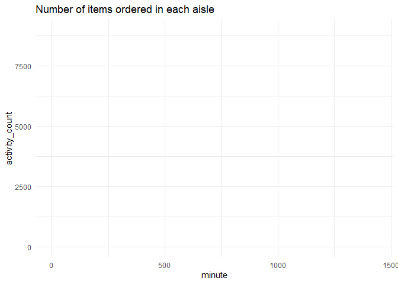
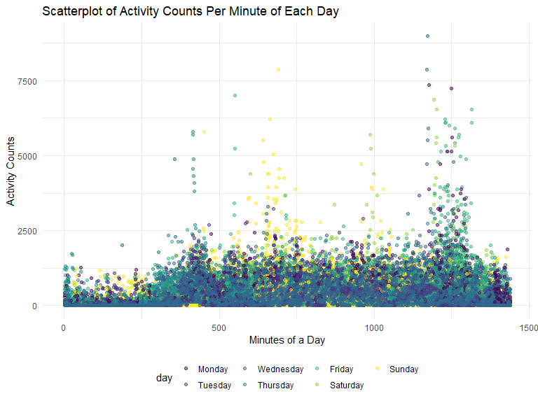
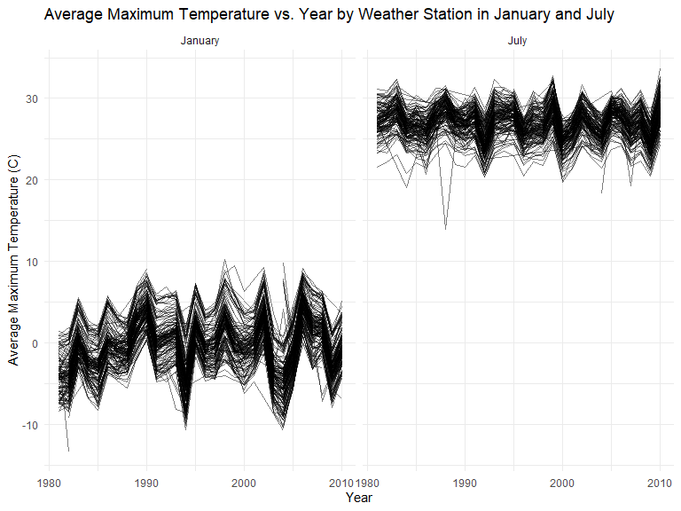
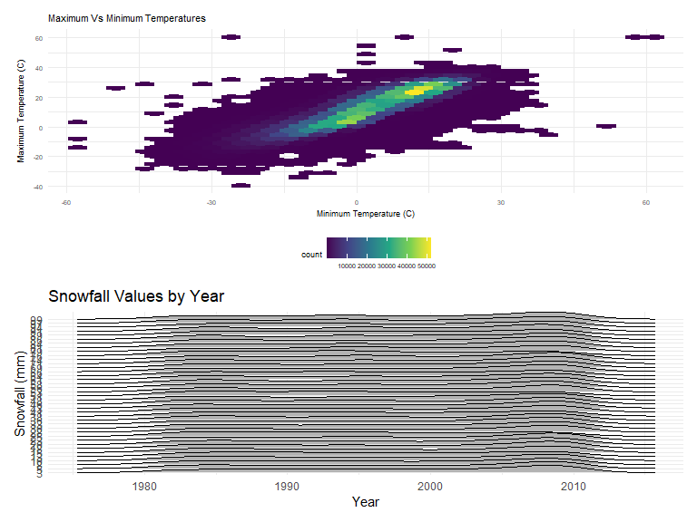

p8105_hw3_jdv2118
================
Justin Vargas

# Loading libraries and settings for plots

``` r
library(tidyverse)

library(janitor)

library(knitr)

library(ggridges)

library(patchwork)

library(p8105.datasets)

opts_chunk$set(
    echo = TRUE,
    warning = FALSE,
    fig.width = 8, 
  fig.height = 6,
  out.width = "90%"
)

theme_set(
  theme_minimal() + theme(legend.position = "bottom")
  )

options(
  ggplot2.continuous.colour = "viridis",
  ggplot2.continuous.fill = "viridis"
)

scale_colour_discrete = scale_colour_viridis_d

scale_fill_discrete = scale_fill_viridis_d
```

# Problem 1

The code below for problem 1 was provided by Dr. Goldsmith prior to the
submission of HW 3 and will be used for future reference.

#### Read in the data

``` r
data("instacart")

instacart = 
  instacart %>% 
  as_tibble(instacart)
```

#### Answer questions about the data

This dataset contains 1384617 rows and 15 columns, with each row
resprenting a single product from an instacart order. Variables include
identifiers for user, order, and product; the order in which each
product was added to the cart. There are several order-level variables,
describing the day and time of the order, and number of days since prior
order. Then there are several item-specific variables, describing the
product name (e.g. Yogurt, Avocado), department (e.g. dairy and eggs,
produce), and aisle (e.g. yogurt, fresh fruits), and whether the item
has been ordered by this user in the past. In total, there are 39123
products found in 131209 orders from 131209 distinct users.

Below is a table summarizing the number of items ordered from aisle. In
total, there are 134 aisles, with fresh vegetables and fresh fruits
holding the most items ordered by far.

``` r
instacart %>% 
  count(aisle) %>% 
  arrange(desc(n))
```

    ## # A tibble: 134 × 2
    ##    aisle                              n
    ##    <chr>                          <int>
    ##  1 fresh vegetables              150609
    ##  2 fresh fruits                  150473
    ##  3 packaged vegetables fruits     78493
    ##  4 yogurt                         55240
    ##  5 packaged cheese                41699
    ##  6 water seltzer sparkling water  36617
    ##  7 milk                           32644
    ##  8 chips pretzels                 31269
    ##  9 soy lactosefree                26240
    ## 10 bread                          23635
    ## # … with 124 more rows

Next is a plot that shows the number of items ordered in each aisle.
Here, aisles are ordered by ascending number of items.

``` r
instacart %>% 
  count(aisle) %>% 
  filter(n > 10000) %>% 
  mutate(aisle = fct_reorder(aisle, n)) %>% 
  ggplot(aes(x = aisle, y = n)) + 
  geom_point() + 
  labs(title = "Number of items ordered in each aisle") +
  theme(axis.text.x = element_text(angle = 60, hjust = 1))
```



Our next table shows the three most popular items in aisles
`baking ingredients`, `dog food care`, and `packaged vegetables fruits`,
and includes the number of times each item is ordered in your table.

``` r
instacart %>% 
  filter(aisle %in% c("baking ingredients", "dog food care", "packaged vegetables fruits")) %>%
  group_by(aisle) %>% 
  count(product_name) %>% 
  mutate(rank = min_rank(desc(n))) %>% 
  filter(rank < 4) %>% 
  arrange(desc(n)) %>%
  knitr::kable()
```

| aisle                      | product_name                                  |    n | rank |
|:---------------------------|:----------------------------------------------|-----:|-----:|
| packaged vegetables fruits | Organic Baby Spinach                          | 9784 |    1 |
| packaged vegetables fruits | Organic Raspberries                           | 5546 |    2 |
| packaged vegetables fruits | Organic Blueberries                           | 4966 |    3 |
| baking ingredients         | Light Brown Sugar                             |  499 |    1 |
| baking ingredients         | Pure Baking Soda                              |  387 |    2 |
| baking ingredients         | Cane Sugar                                    |  336 |    3 |
| dog food care              | Snack Sticks Chicken & Rice Recipe Dog Treats |   30 |    1 |
| dog food care              | Organix Chicken & Brown Rice Recipe           |   28 |    2 |
| dog food care              | Small Dog Biscuits                            |   26 |    3 |

Finally is a table showing the mean hour of the day at which Pink Lady
Apples and Coffee Ice Cream are ordered on each day of the week. This
table has been formatted in an untidy manner for human readers. Pink
Lady Apples are generally purchased slightly earlier in the day than
Coffee Ice Cream, with the exception of day 5.

``` r
instacart %>%
  filter(product_name %in% c("Pink Lady Apples", "Coffee Ice Cream")) %>%
  group_by(product_name, order_dow) %>%
  summarize(mean_hour = mean(order_hour_of_day)) %>%
  spread(key = order_dow, value = mean_hour) %>%
  knitr::kable(digits = 2)
```

| product_name     |     0 |     1 |     2 |     3 |     4 |     5 |     6 |
|:-----------------|------:|------:|------:|------:|------:|------:|------:|
| Coffee Ice Cream | 13.77 | 14.32 | 15.38 | 15.32 | 15.22 | 12.26 | 13.83 |
| Pink Lady Apples | 13.44 | 11.36 | 11.70 | 14.25 | 11.55 | 12.78 | 11.94 |

# Problem 2

## Data cleaning and tidying

``` r
accelerometer_data = 
  read_csv("data/accel_data.csv") %>%
  clean_names() %>%
  pivot_longer(
  activity_1:activity_1440,
    names_to = "minute",
    values_to = "activity_count",
    names_prefix = "activity_") %>%
  mutate(
      day = factor(day, levels = c("Monday", "Tuesday", "Wednesday", "Thursday", "Friday", "Saturday", "Sunday")),
    weekday_vs_weekend =
    if_else(day %in% c("Saturday", "Sunday"), 'Weekend', 'Weekday'), 
    minute = as.numeric(minute))
    
accelerometer_data
```

    ## # A tibble: 50,400 × 6
    ##     week day_id day    minute activity_count weekday_vs_weekend
    ##    <dbl>  <dbl> <fct>   <dbl>          <dbl> <chr>             
    ##  1     1      1 Friday      1           88.4 Weekday           
    ##  2     1      1 Friday      2           82.2 Weekday           
    ##  3     1      1 Friday      3           64.4 Weekday           
    ##  4     1      1 Friday      4           70.0 Weekday           
    ##  5     1      1 Friday      5           75.0 Weekday           
    ##  6     1      1 Friday      6           66.3 Weekday           
    ##  7     1      1 Friday      7           53.8 Weekday           
    ##  8     1      1 Friday      8           47.8 Weekday           
    ##  9     1      1 Friday      9           55.5 Weekday           
    ## 10     1      1 Friday     10           43.0 Weekday           
    ## # … with 50,390 more rows

The aforementioned dataset, which the data for has been tidied and
wrangled, focuses on accelerometer data that was collected from a 63
year-old male, who has a BMI of 25 and has been diagnosed with
congestive heart failure. The dataset consists of 6 columns and 50400
rows. The 6 variables within the dataset are “week”, “day_id”, “day”,
“minute”, “activity_count”, and “weekday_vs_weekend”. There are 4
variables in the dataset that have a double class and they are “week”,
“day_id”, “minute”, and “activity_count”. The “day” variable has a
factor data type and “weekday_vs_weekend” is a character data type. It
is important to note that the “weekday_vs_weekend” variable was not part
of the original dataset and was created once the data was tidied and
wrangled to differentiate whether the name of the day in the “day”
variable was either a weekday or a weekend.

## Total activity count table

``` r
total_activity_table =  
  accelerometer_data %>%
  group_by(week, day) %>%
  summarize(
    total_activity = sum(activity_count, na.rm = TRUE) #Is the na.rm = TRUE necessary?
  ) %>%
  pivot_wider(
  names_from = "day",
  values_from = "total_activity"
) %>%
clean_names()

total_activity_table
```

    ## # A tibble: 5 × 8
    ## # Groups:   week [5]
    ##    week  monday tuesday wednesday thursday  friday saturday sunday
    ##   <dbl>   <dbl>   <dbl>     <dbl>    <dbl>   <dbl>    <dbl>  <dbl>
    ## 1     1  78828. 307094.   340115.  355924. 480543.   376254 631105
    ## 2     2 295431  423245    440962   474048  568839    607175 422018
    ## 3     3 685910  381507    468869   371230  467420    382928 467052
    ## 4     4 409450  319568    434460   340291  154049      1440 260617
    ## 5     5 389080  367824    445366   549658  620860      1440 138421

The code above is used to create a table that consists of the total
activity counts for each day that data was collected. This table does
illustrate apparent trends. One trend is that for all weekdays, the
total activity counts increase from the first week to the fifth week for
each corresponding weekday. Another trend is that the total activity
counts on Sunday decrease from the first week to the fifth week. One
other trend is that the total activity counts on Saturday decrease from
the first week to the fifth week. Another trend is that the total
activity counts increase from Monday to Sunday for the first and second
week. However, the total activity counts decrease from Monday to Sunday
for the third, fourth, and fifth weeks.

## Scatterplot of activity counts by minute of each day

``` r
ggplot(accelerometer_data, aes(x = minute, y = activity_count, color = day)) + 
  geom_point(alpha = .5) +
  labs(
    x = "Minutes of a Day",
    y = "Activity Counts",
    title = "Scatterplot of Activity Counts Per Minute of Each Day"
  )
```



The code above is used to create a scatterplot of activity counts by
minutes of the day. One pattern that can be observed from this
scatterplot is that the activity counts are lowest at the beginning of
each day of the week. Another pattern is that some activity counts for
certain days are the highest roughly between the 1200 to 1300 minutes of
the day, which would be roughly between 8:00pm and 9:40pm. Also, the
activity counts generally increase after the 250 minute mark for each
day and stay relatively stable until the 1300 minute mark. After the
1300 minute mark, the activity counts for each day decrease, but are
still higher than they were at the beginning of each day.

# Problem 3

## Loading data

``` r
data("ny_noaa")

ny_noaa
```

    ## # A tibble: 2,595,176 × 7
    ##    id          date        prcp  snow  snwd tmax  tmin 
    ##    <chr>       <date>     <int> <int> <int> <chr> <chr>
    ##  1 US1NYAB0001 2007-11-01    NA    NA    NA <NA>  <NA> 
    ##  2 US1NYAB0001 2007-11-02    NA    NA    NA <NA>  <NA> 
    ##  3 US1NYAB0001 2007-11-03    NA    NA    NA <NA>  <NA> 
    ##  4 US1NYAB0001 2007-11-04    NA    NA    NA <NA>  <NA> 
    ##  5 US1NYAB0001 2007-11-05    NA    NA    NA <NA>  <NA> 
    ##  6 US1NYAB0001 2007-11-06    NA    NA    NA <NA>  <NA> 
    ##  7 US1NYAB0001 2007-11-07    NA    NA    NA <NA>  <NA> 
    ##  8 US1NYAB0001 2007-11-08    NA    NA    NA <NA>  <NA> 
    ##  9 US1NYAB0001 2007-11-09    NA    NA    NA <NA>  <NA> 
    ## 10 US1NYAB0001 2007-11-10    NA    NA    NA <NA>  <NA> 
    ## # … with 2,595,166 more rows

The code above is used to load the “p8105.datasets” package and load the
dataset called “ny_noaa”. The dataset consists of 2595176 rows and 7
columns. There are 7 variables, which are “id”, “date”, “prcp”, “snow”,
“snwd”, “tmax”, and “tmin”. All of the variables except for “id” and
“date” have a integer data type, while “date” has a date data type and
“id” has a character data type. It is important to note that missing
data can be found in all variables except for “date” and “id”. Missing
data may cause issues when computing summaries of the data and may
affect the plots that will be created using the data.

## Data cleaning and tidying

``` r
ny_noaa_tidy =
  ny_noaa %>%
separate(col = date,   into = c("year", "month", "day"), sep = "-") %>%
mutate(
   year = as.numeric(year),
   month = as.numeric(month),
   day = as.numeric(day),
   tmax = as.numeric(tmax),
   tmin = as.numeric(tmin),
   tmax = tmax / 10,
   tmin = tmin / 10,
   prcp = prcp / 10
)

ny_noaa_tidy
```

    ## # A tibble: 2,595,176 × 9
    ##    id           year month   day  prcp  snow  snwd  tmax  tmin
    ##    <chr>       <dbl> <dbl> <dbl> <dbl> <int> <int> <dbl> <dbl>
    ##  1 US1NYAB0001  2007    11     1    NA    NA    NA    NA    NA
    ##  2 US1NYAB0001  2007    11     2    NA    NA    NA    NA    NA
    ##  3 US1NYAB0001  2007    11     3    NA    NA    NA    NA    NA
    ##  4 US1NYAB0001  2007    11     4    NA    NA    NA    NA    NA
    ##  5 US1NYAB0001  2007    11     5    NA    NA    NA    NA    NA
    ##  6 US1NYAB0001  2007    11     6    NA    NA    NA    NA    NA
    ##  7 US1NYAB0001  2007    11     7    NA    NA    NA    NA    NA
    ##  8 US1NYAB0001  2007    11     8    NA    NA    NA    NA    NA
    ##  9 US1NYAB0001  2007    11     9    NA    NA    NA    NA    NA
    ## 10 US1NYAB0001  2007    11    10    NA    NA    NA    NA    NA
    ## # … with 2,595,166 more rows

The code above was used to separate variables for “year”, “month”, and
“day”. The variables of “tmax”, “tmin”, “prcp” were changed to ensure
that they were in reasonable units. The variable, “snowfall”, was not
changed as it was already in a reasonable unit.

``` r
ny_noaa_snow = 
  ny_noaa_tidy %>%
  count(snow) %>%
  arrange(desc(n))

ny_noaa_snow
```

    ## # A tibble: 282 × 2
    ##     snow       n
    ##    <int>   <int>
    ##  1     0 2008508
    ##  2    NA  381221
    ##  3    25   31022
    ##  4    13   23095
    ##  5    51   18274
    ##  6    76   10173
    ##  7     8    9962
    ##  8     5    9748
    ##  9    38    9197
    ## 10     3    8790
    ## # … with 272 more rows

The code above is used to create a table of the most commonly observed
values of snowfall, which are “0”, “NA”, and “25”, respectively in that
order. “0” and “NA” may be the most commonly observed values for
snowfall as it either does not snow at a weather station or data is not
collected in regards to snowfall at a weather station.

## Line plot of average maximum temperature by year for January and July

``` r
  ny_noaa_tidy %>% 
  group_by(id, year, month) %>%
  filter(
    month %in% c("1", "7")
  ) %>% 
  mutate(month = recode(month, '1' = "January", '7' = "July")) %>%
  summarize(
    average_tmax = mean(tmax, na.rm = TRUE)
  ) %>%
  ggplot(aes(x = year, y = average_tmax, group = id)) +
  geom_line(alpha = 0.5) +
  labs(
    x = "Year",
    y = "Average Maximum Temperature (C)",
    title = "Average Maximum Temperature vs. Year by Weather Station in January and July",
  ) +
  facet_grid(. ~ month)
```



The code above is used to create a two-panel plot of average maximum
temperature by year for the months of January and July. Based on the
computed two-panel plot, we can see that the average maximum temperature
in July is higher than the average maximum temperature in January across
all years from 1980 to 2010.

``` r
outliers =
ny_noaa_tidy %>% 
  group_by(id, year, month) %>%
  filter(
    month %in% c("1", "7")
  ) %>% 
  summarize(
    average_tmax = mean(tmax, na.rm = TRUE)
  )
```

Based on the computed two-panel plot, there are outliers. For example,
one outlier is NaN, which is the minimum value in the dataset for the
average maximum temperature, and another outlier is NaN, which is the
maximum value in the dataset for the average maximum temperature.

``` r
tmax_and_tmin =
ny_noaa_tidy %>% 
ggplot(aes(x = tmin, y = tmax)) +
  geom_hex() +
    labs(
    x = "Minimum Temperature (C)",
    y = "Maximum Temperature (C)",
    title = "Maximum Vs Minimum Temperatures"
    ) + 
  theme(legend.position = "bottom", text = element_text(size = 7))


snowfall_distribution =
  ny_noaa_tidy %>% 
  filter(snow > 0 & snow < 100) %>%
  ggplot(aes(x = year, y = factor(snow))) +
  geom_density_ridges() +
  labs(
    x = "Year",
    y = "Snowfall (mm)",
    title = "Snowfall Values by Year"
    ) 

tmax_and_tmin / snowfall_distribution
```



The code above is used to create a two-panel plot that shows a plot of
tmax by tmin for the whole dataset and another plot shows the
distribution of snowfall values that are greater than 0 and less than
100 separately by year. The first plot shows that the most common
maximum temperature is roughly 20 degrees celsius and the most common
minimum temperature is 15 degrees celsius. The most common minimum
temperatures can roughly be found between -15 degrees celsius and 15
degrees celsius, while the most common maximum temperatures can be
roughly found between 0 and 30 degrees celsius.

The second plot shows that the snowfall values are the highest around
2010. The plot also shows that snowfall values are also high between
1980 and 1990.
