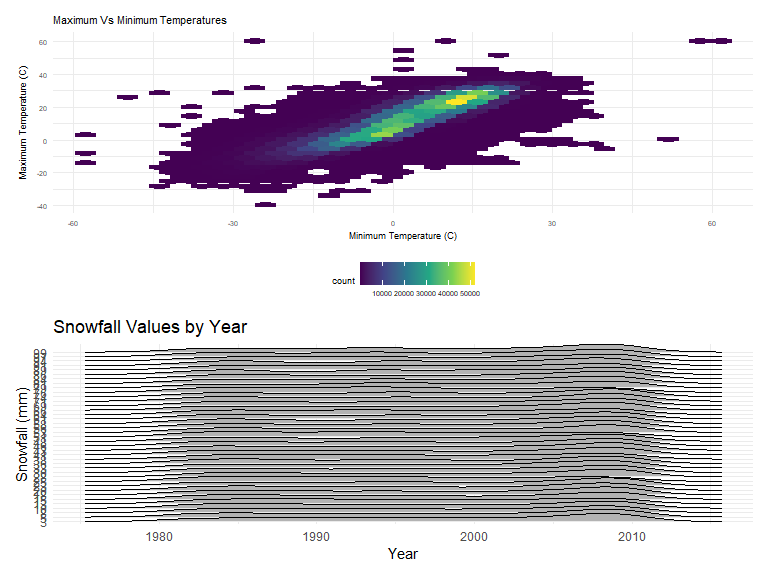

p8105_hw3_jdv2118
================
Justin Vargas

# Loading libraries and settings for plots

``` r
library(tidyverse)
```

    ## ── Attaching packages ─────────────────────────────────────── tidyverse 1.3.2 ──
    ## ✔ ggplot2 3.3.6      ✔ purrr   0.3.4 
    ## ✔ tibble  3.1.8      ✔ dplyr   1.0.10
    ## ✔ tidyr   1.2.1      ✔ stringr 1.4.1 
    ## ✔ readr   2.1.2      ✔ forcats 0.5.2 
    ## ── Conflicts ────────────────────────────────────────── tidyverse_conflicts() ──
    ## ✖ dplyr::filter() masks stats::filter()
    ## ✖ dplyr::lag()    masks stats::lag()

``` r
library(janitor)
```

    ## 
    ## Attaching package: 'janitor'
    ## 
    ## The following objects are masked from 'package:stats':
    ## 
    ##     chisq.test, fisher.test

``` r
library(knitr)

library(ggridges)

library(patchwork)

opts_chunk$set(
    echo = TRUE,
    warning = FALSE,
    fig.width = 8, 
  fig.height = 6,
  out.width = "90%"
)

theme_set(
  theme_minimal() + theme(legend.position = "bottom")
  )

options(
  ggplot2.continuous.colour = "viridis",
  ggplot2.continuous.fill = "viridis"
)

scale_colour_discrete = scale_colour_viridis_d

scale_fill_discrete = scale_fill_viridis_d
```

# Problem 2

``` r
accelerometer_data = 
  read_csv("data/accel_data.csv") %>%
  clean_names() %>%
  pivot_longer(
  activity_1:activity_1440,
    names_to = "minute",
    values_to = "activity_count",
    names_prefix = "activity_") %>%
  mutate(
      day = factor(day, levels = c("Monday", "Tuesday", "Wednesday", "Thursday", "Friday", "Saturday", "Sunday")),
    weekday_vs_weekend =
    if_else(day %in% c("Saturday", "Sunday"), 'Weekend', 'Weekday'), 
    minute = as.numeric(minute))
```

    ## Rows: 35 Columns: 1443
    ## ── Column specification ────────────────────────────────────────────────────────
    ## Delimiter: ","
    ## chr    (1): day
    ## dbl (1442): week, day_id, activity.1, activity.2, activity.3, activity.4, ac...
    ## 
    ## ℹ Use `spec()` to retrieve the full column specification for this data.
    ## ℹ Specify the column types or set `show_col_types = FALSE` to quiet this message.

``` r
accelerometer_data
```

    ## # A tibble: 50,400 × 6
    ##     week day_id day    minute activity_count weekday_vs_weekend
    ##    <dbl>  <dbl> <fct>   <dbl>          <dbl> <chr>             
    ##  1     1      1 Friday      1           88.4 Weekday           
    ##  2     1      1 Friday      2           82.2 Weekday           
    ##  3     1      1 Friday      3           64.4 Weekday           
    ##  4     1      1 Friday      4           70.0 Weekday           
    ##  5     1      1 Friday      5           75.0 Weekday           
    ##  6     1      1 Friday      6           66.3 Weekday           
    ##  7     1      1 Friday      7           53.8 Weekday           
    ##  8     1      1 Friday      8           47.8 Weekday           
    ##  9     1      1 Friday      9           55.5 Weekday           
    ## 10     1      1 Friday     10           43.0 Weekday           
    ## # … with 50,390 more rows

The aforementioned dataset, which the data for has been tidied and
wrangled, focuses on accelerometer data that was collected from a 63
year-old male, who has a BMI of 25 and has been diagnosed with
congestive heart failure. The dataset consists of 6 columns and 50400
rows. The 6 variables within the dataset are “week”, “day_id”, “day”,
“minute”, “activity_count”, and “weekday_vs_weekend”. There are 4
variables in the dataset that have a double class and they are “week”,
“day_id”, “minute”, and “activity_count”. The “day” variable is a factor
data type and “weekday_vs_weekend” is a character data type. It is
important to note that the “weekday_vs_weekend” variable was not part of
the original dataset and was created once the data was tidied and
wrangled to differentiate whether the day name in the “day” variable was
either a weekday or a weekend.

``` r
total_activity_table =  
  accelerometer_data %>%
  group_by(week, day) %>%
  summarize(
    total_activity = sum(activity_count, na.rm = TRUE) #Is the na.rm = TRUE necessary?
  ) %>%
  pivot_wider(
  names_from = "day",
  values_from = "total_activity"
) %>%
clean_names()
```

    ## `summarise()` has grouped output by 'week'. You can override using the
    ## `.groups` argument.

``` r
total_activity_table
```

    ## # A tibble: 5 × 8
    ## # Groups:   week [5]
    ##    week  monday tuesday wednesday thursday  friday saturday sunday
    ##   <dbl>   <dbl>   <dbl>     <dbl>    <dbl>   <dbl>    <dbl>  <dbl>
    ## 1     1  78828. 307094.   340115.  355924. 480543.   376254 631105
    ## 2     2 295431  423245    440962   474048  568839    607175 422018
    ## 3     3 685910  381507    468869   371230  467420    382928 467052
    ## 4     4 409450  319568    434460   340291  154049      1440 260617
    ## 5     5 389080  367824    445366   549658  620860      1440 138421

``` r
ggplot(accelerometer_data, aes(x = minute, y = activity_count, color = day)) + 
  geom_point(alpha = .5) +
  labs(
    x = "Minutes of a Day",
    y = "Activity Counts",
    title = "Scatterplot of Activity Counts Per Minute of Each Day"
  )
```


# Problem 3

``` r
library(p8105.datasets)

data("ny_noaa")
```

``` r
ny_noaa_tidy =
  ny_noaa %>%
separate(col = date,   into = c("year", "month", "day"), sep = "-") %>%
mutate(
   year = as.numeric(year),
   month = as.numeric(month),
   day = as.numeric(day),
   tmax = as.numeric(tmax),
   tmin = as.numeric(tmin),
   tmax = tmax / 10,
   tmin = tmin / 10,
   prcp = prcp / 10
)

ny_noaa_tidy
```

    ## # A tibble: 2,595,176 × 9
    ##    id           year month   day  prcp  snow  snwd  tmax  tmin
    ##    <chr>       <dbl> <dbl> <dbl> <dbl> <int> <int> <dbl> <dbl>
    ##  1 US1NYAB0001  2007    11     1    NA    NA    NA    NA    NA
    ##  2 US1NYAB0001  2007    11     2    NA    NA    NA    NA    NA
    ##  3 US1NYAB0001  2007    11     3    NA    NA    NA    NA    NA
    ##  4 US1NYAB0001  2007    11     4    NA    NA    NA    NA    NA
    ##  5 US1NYAB0001  2007    11     5    NA    NA    NA    NA    NA
    ##  6 US1NYAB0001  2007    11     6    NA    NA    NA    NA    NA
    ##  7 US1NYAB0001  2007    11     7    NA    NA    NA    NA    NA
    ##  8 US1NYAB0001  2007    11     8    NA    NA    NA    NA    NA
    ##  9 US1NYAB0001  2007    11     9    NA    NA    NA    NA    NA
    ## 10 US1NYAB0001  2007    11    10    NA    NA    NA    NA    NA
    ## # … with 2,595,166 more rows

``` r
ny_noaa_snow = 
  ny_noaa_tidy %>%
  count(snow) %>%
  arrange(desc(n))

ny_noaa_snow
```

    ## # A tibble: 282 × 2
    ##     snow       n
    ##    <int>   <int>
    ##  1     0 2008508
    ##  2    NA  381221
    ##  3    25   31022
    ##  4    13   23095
    ##  5    51   18274
    ##  6    76   10173
    ##  7     8    9962
    ##  8     5    9748
    ##  9    38    9197
    ## 10     3    8790
    ## # … with 272 more rows

``` r
  ny_noaa_tidy %>% 
  group_by(id, year, month) %>%
  filter(
    month %in% c("1", "7")
  ) %>% 
  summarize(
    average_tmax = mean(tmax, na.rm = TRUE)
  ) %>%
  ggplot(aes(x = year, y = average_tmax, group = id)) +
  geom_line(alpha = 0.5) +
  labs(
    x = "Year",
    y = "Average Maximum Temperature (C)",
    title = "Average Maximum Temperature vs. year by weather station in January and July",
  ) +
  facet_grid(. ~ month)
```

    ## `summarise()` has grouped output by 'id', 'year'. You can override using the
    ## `.groups` argument.


``` r
outliers =
ny_noaa_tidy %>% 
  group_by(id, year, month) %>%
  filter(
    month %in% c("1", "7")
  ) %>% 
  summarize(
    average_tmax = mean(tmax, na.rm = TRUE)
  )
```

    ## `summarise()` has grouped output by 'id', 'year'. You can override using the
    ## `.groups` argument.

``` r
summary(pull(outliers, average_tmax))
```

    ##    Min. 1st Qu.  Median    Mean 3rd Qu.    Max.    NA's 
    ## -13.439  -0.217   8.635  13.312  27.003  33.600    5970

``` r
tmax_and_tmin =
ny_noaa_tidy %>% 
ggplot(aes(x = tmin, y = tmax)) +
  geom_hex() +
    labs(
    x = "Minimum Temperature (C)",
    y = "Maximum Temperature (C)",
    title = "Maximum Vs Minimum Temperatures"
    ) + 
  theme(legend.position = "bottom", text = element_text(size = 7))


snowfall_distribution =
  ny_noaa_tidy %>% 
  filter(snow > 0 & snow < 100) %>%
  ggplot(aes(x = year, y = factor(snow))) +
  geom_density_ridges() +
  labs(
    x = "Year",
    y = "Snowfall (mm)",
    title = "Snowfall Values by Year"
    ) 

tmax_and_tmin / snowfall_distribution
```

    ## Picking joint bandwidth of 1.9


